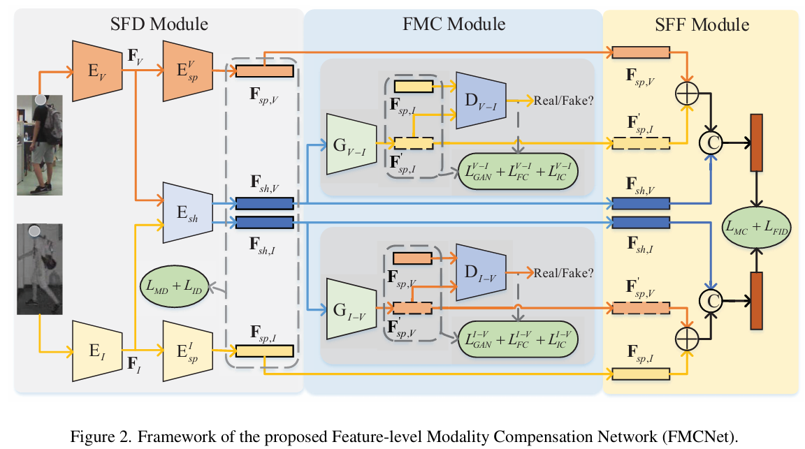

# FMCNet_series

# Papers
1. CVPR2023: [FMCNet: Feature-Level Modality Compensation for Visible-Infrared Person Re-Identification](https://ieeexplore.ieee.org/document/9880449)

2. FMCNet+ (update soon)

# Update process
The code library of FMCNet_series about Visible-Infrared Re-Identification (VI-ReID) will be updated soon.